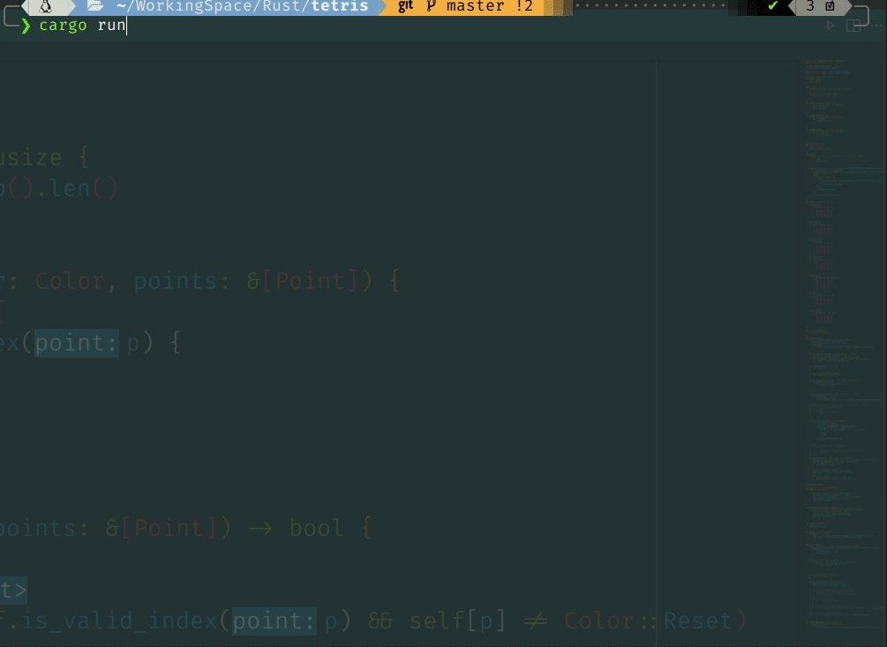

# tetris game

I've been learning rust for three days and using multithreading for the first time, and will take this as a result.

## compile

~~~bash
cargo run
~~~

then done.

## how to play

- down, left, right: ...
- up: rotate
- space: hard drop
- z, up: rotate clockwise
- x: rotate counterclockwise
- p: pause
- q, ctrl+c: quit (then press any key to go back to former screen)

## screenshot

