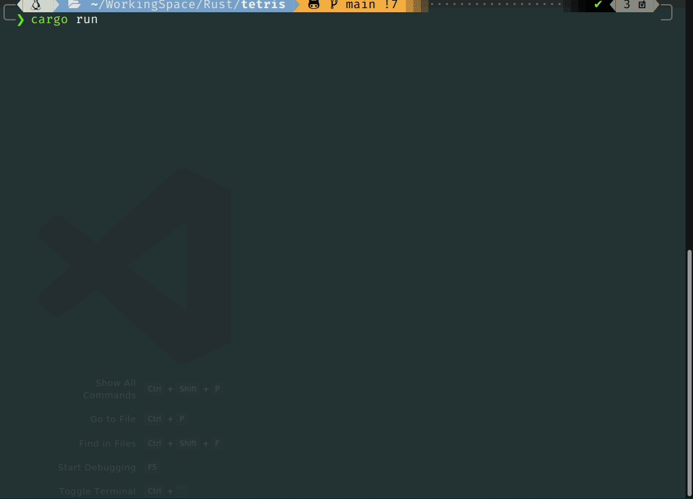

# tetris game

I downloaded `bastard`, a tetris game, on linux, and then realized that its block selection is not random (which is why I encountered O ten times in a row). 🤔

It just so happens that I've been learning Rust and multithreading for the last three days, so I wrote this game. I won't be playing this game after writing it though, I guess. 😬

## compile

~~~bash
cargo run
~~~

then done.

## how to play

- down, left, right: ...
- up: rotate
- space: hard drop
- z, up: rotate clockwise
- x: rotate counterclockwise
- p: pause
- q, ctrl+c: quit (then press any key to go back to former screen)

## screenshot

